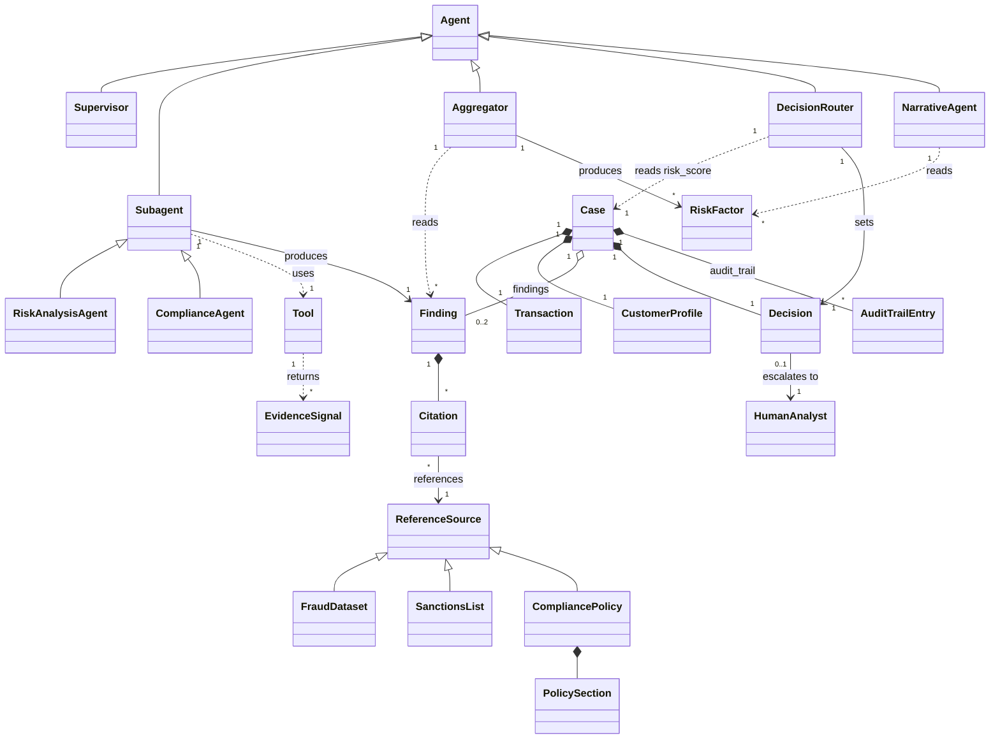

# Sentinel domain ontology

This describes the concepts Sentinel actually operates on -- the classes,
their attributes, and how they relate -- derived directly from the code
(`fraud_agent/state.py`, `tools.py`, `subagents.py`, `aggregator.py`,
`graph.py`), not an idealized model. Where the code and this document
disagree, the code is right; update this file to match.

## Why this exists

Everything downstream of the transaction data -- the routing decision, the
scores, the citations, the audit log -- is really just instances of a small
number of classes flowing through a fixed pipeline of agents. Naming that
model explicitly makes it easier to explain the system, spot where a new
field belongs, and see which parts are grounded in real data versus
simulated (a distinction this ontology treats as first-class, since it's
been the central design question of this project).

## Class hierarchy



## Classes

| Class | Code location | Description |
|---|---|---|
| **Case** | `FraudCaseState` (`state.py`) | The unit of work: one transaction moving through the graph. Everything else is either part of a Case or produced while processing one. |
| **Transaction** | `state["transaction"]` | The payment event under review. Data properties: `id`, `amount`, `currency`, `merchant`, `category`, `channel`, `geo`, `home_geo`, `device_id`, `device_new`, `ip_address`, `new_payee`. |
| **CustomerProfile** | `state["customer_profile"]` | The account the transaction belongs to. Data properties: `account_id`, `name`, `prior_flag_count`. |
| **Agent** | every `*_node` function | Anything that acts on a Case and appends to its audit trail. Abstract -- always one of the subclasses below. |
| **Supervisor** | `supervisor.py` | Deterministic (no LLM). Reads Transaction + CustomerProfile, decides the **Route** (which Subagents run) via `FAST_PATH` / `FULL_SUITE`. |
| **Subagent** | `subagents.py` | An LLM tool-calling agent (`create_react_agent`) that produces exactly one Finding. Abstract -- `RiskAnalysisAgent` or `ComplianceAgent`. |
| **RiskAnalysisAgent** | `SUBAGENT_SPECS["risk_analysis"]` | Uses the `gather_risk_evidence` Tool. |
| **ComplianceAgent** | `SUBAGENT_SPECS["compliance"]` | Uses the `gather_compliance_evidence` Tool; its prompt includes the full CompliancePolicy text. |
| **Aggregator** | `aggregator.py` | Deterministic (no LLM). Reads all Findings, applies `WEIGHTS` and the `COMPLIANCE_HARD_OVERRIDE_SCORE` rule, produces `risk_score` and the `RiskFactor` list. |
| **DecisionRouter** | `decide()` + `approve_node`/`decline_node` in `graph.py` | Deterministic. Compares `risk_score` against `APPROVE_MAX` / `DECLINE_MIN` and sets **Decision**, or defers to escalation. |
| **HumanAnalyst** | `human_review_node` | External actor. The graph pauses (`interrupt()`) until this actor supplies the Decision via `POST /api/cases/{id}/resume`. |
| **NarrativeAgent** | `narrative.py` | An LLM call (no tools) that turns the RiskFactor list + Decision into analyst-readable prose. Runs on decline/escalate paths, skipped on auto-approve. |
| **Finding** | one entry in `state["findings"]` | A Subagent's output: `score` (0-100 or `null` if the agent failed after retries), `reason` (the LLM's explanation), `citations`. |
| **RiskFactor** | one entry in `state["risk_factors"]` | A Finding after the Aggregator has processed it -- same shape, plus it's what the Decision was actually based on. |
| **Citation** | `explain_risk_evidence` / `explain_compliance_evidence` (`tools.py`) | Computed **deterministically in Python**, independent of the LLM, so it can't be misquoted. Data properties: `label`, `source`, `excerpt`, `path`. |
| **ReferenceSource** | `data/reference/` | Abstract. Anything a Citation can point to. Carries a **provenance**: `real` or `simulated`. |
| **FraudDataset** | `data/reference/amount_baseline.json` | Real. Percentile/fraud-rate statistics from the ULB Credit Card Fraud Detection dataset (284,807 real transactions). |
| **SanctionsList** | `data/reference/ofac_sdn.csv` | Real. The current US Treasury OFAC SDN list (~19,000 entries), fuzzy-matched via `difflib`. |
| **CompliancePolicy** | `data/reference/compliance_policy.md` | Real. Composed of numbered **PolicySection**s (1: OFAC screening, 2: structuring/CTR, 3: FATF jurisdictions, 4: scope note) that a Citation can cite by number. |
| **Decision** | `state["decision"]` | One of `approve`, `decline`, `escalate` -> resolved to `approve`/`decline`. Thresholds: `risk_score <= 25` auto-approve, `>= 90` auto-decline, otherwise escalate. |
| **AuditTrailEntry** | one entry in `state["audit_trail"]` (`log_entry()`) | `{node, detail, time}`. Every Agent appends one per invocation; this is exactly what the "Agent log" UI tab renders, sorted by `time` since parallel Subagents can land out of order. |
| **Tool** | `@tool`-decorated functions (`tools.py`) | `gather_risk_evidence`, `gather_compliance_evidence`. What a Subagent is allowed to call; returns **EvidenceSignal**s. |
| **EvidenceSignal** | the dict a Tool returns | The raw material a Subagent's score is based on -- e.g. `amount_vs_real_reference_data` (real), `sanctions_screen` (real), `device` / `ip_reputation` / `recent_activity` / `geo_check` / `linked_entities` (simulated -- deterministically hashed from the input, not looked up anywhere real). |

## Object properties (relationships)

| Property | Domain -> Range | Cardinality | Notes |
|---|---|---|---|
| `hasTransaction` | Case -> Transaction | 1:1 | |
| `hasCustomerProfile` | Case -> CustomerProfile | 1:1 | |
| `routesTo` | Supervisor -> Subagent | 1:0..2 | Fast-path = RiskAnalysisAgent only; full review = both. |
| `produces` | Subagent -> Finding | 1:1 per run | Keyed by agent name in `findings`, so parallel writes never collide. |
| `uses` | Subagent -> Tool | 1:1 | |
| `returns` | Tool -> EvidenceSignal | 1:many | |
| `hasCitation` | Finding -> Citation | 1:many | |
| `references` | Citation -> ReferenceSource | many:1 | |
| `aggregates` | Aggregator -> Finding | 1:many (reads) | |
| `yields` | Aggregator -> RiskFactor | 1:many (writes) | |
| `setsDecision` | DecisionRouter -> Decision | 1:1 | |
| `escalatesTo` | Decision -> HumanAnalyst | 0..1:1 | Only when between thresholds. |
| `resolves` | HumanAnalyst -> Decision | 1:1 | Overwrites the pending value via `Command(resume=...)`. |
| `explains` | NarrativeAgent -> Decision | 1:1 | |
| `logs` | Agent -> AuditTrailEntry | 1:many | Every agent, every invocation. |

## Provenance: the distinction that actually drives the design

Every `EvidenceSignal` and every `ReferenceSource` carries a provenance tag,
and it's the one modeling decision that shaped the most work in this
project:

- **`real`** — `amount_vs_real_reference_data` (ULB dataset), `sanctions_screen`
  and `jurisdiction_check` (OFAC SDN list + FATF lists via CompliancePolicy),
  `rules` (real BSA/CTR thresholds, 31 CFR 1010.311 / 31 U.S.C. Sec. 5324).
- **`simulated`** — `recent_activity`, `geo_check`, `device`, `ip_reputation`,
  `linked_entities`. Deterministically hashed from the input (`_stable_fraction`
  in `tools.py`), not looked up anywhere real, because no public dataset can
  legitimately expose real per-account device/session history.

Every Citation makes this explicit in its `source` field, so an analyst
(or this ontology's reader) never has to guess which numbers are grounded.

## Worked instance

The Aurelia Electronics case (`TXN-88213-7745`), as actual instances of
these classes:

```
Transaction(id="TXN-88213-7745", amount=2340, currency="USD",
            merchant="Aurelia Electronics", category="electronics",
            channel="ecommerce", geo="Lagos, NG", home_geo="Columbus, OH",
            device_id="dev-9a21", device_new=true,
            ip_address="197.210.54.12", new_payee=false)

CustomerProfile(account_id="acct-4417", name="J. Whitfield", prior_flag_count=0)

Case(id="TXN-88213-7745") hasTransaction Transaction
Case                       hasCustomerProfile CustomerProfile

Supervisor routesTo [RiskAnalysisAgent, ComplianceAgent]   # full review:
                                                            # amount > $250 and device_new

RiskAnalysisAgent produces Finding(score=92, reason="... 99.5th percentile ...")
Finding hasCitation Citation(label="Amount vs. a real fraud dataset",
                              source="ULB ... dataset (284,807 real transactions)",
                              provenance=real)
Finding hasCitation Citation(label="Recent activity, device, IP, network signals",
                              source="Simulated -- not from a real data source",
                              provenance=simulated)

ComplianceAgent produces Finding(score=5, reason="No sanctions match ...")
Finding hasCitation Citation(label="OFAC sanctions screen", source="US Treasury OFAC SDN list",
                              provenance=real)

Aggregator yields RiskFactor[RiskAnalysis(92), Compliance(5)] -> risk_score=61.6
DecisionRouter setsDecision escalate   # 25 < 61.6 < 90
Decision escalatesTo HumanAnalyst
HumanAnalyst resolves Decision(approve)
NarrativeAgent explains Decision -> narrative text
```

## Where this doesn't (yet) apply

This ontology describes the pipeline as built. It does not model: multiple
transactions per Case (one Case is always exactly one Transaction), a real
per-account history (deliberately absent -- see Provenance), or anything
about the UI layer (`ui/server.py`'s registry is a persistence detail, not
a domain concept). If those get added, extend this document alongside the
code, the same way `compliance_policy.md` was extended when jurisdiction
checking was added.
